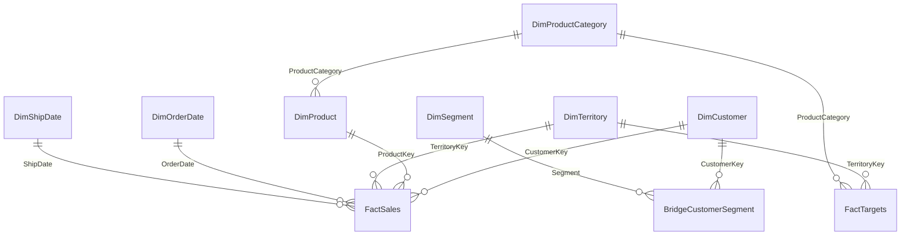

# Module 1 Labs: Advanced Semantic Modeling

## Lab summary

These labs use synthetic CSV data to build a reusable semantic model for Contoso Advanced Manufacturing.

## Azure Government readiness

The required labs are **Gov-ready** because they use local CSV files and core Power BI Desktop modeling features. Composite model, DirectQuery, hybrid table, and large semantic model portions are **Verify for Gov** and should be treated as optional unless the target tenant and tooling are validated.

## Lab data

| File | Description |
|---|---|
| `https://raw.githubusercontent.com/Coding-Forge/PBI-Advanced-Factory/main/data/sales-flat.csv` | Flat transaction export used for star schema refactoring. |
| `https://raw.githubusercontent.com/Coding-Forge/PBI-Advanced-Factory/main/data/customer-segments.csv` | Multi-valued customer segment mapping. |
| `https://raw.githubusercontent.com/Coding-Forge/PBI-Advanced-Factory/main/data/targets.csv` | Monthly territory/product category target data. |

Use **Get data > Web** in Power BI Desktop and paste the raw URL for each CSV.

## Novice-friendly how-to guide

This module includes detailed how-to sections for the steps that are easiest for newer Power BI authors to miss:

- Creating fact and dimension queries from a raw Power Query source.
- Creating `DimProductCategory` to avoid a many-to-many target relationship.
- Building reusable Power Query and DAX date tables.
- Creating relationships with explicit PK/FK, cardinality, and cross-filter direction settings.
- Evaluating composite model and DirectQuery design choices conceptually.

Follow the numbered steps and exact object names in each lab section before moving to the next lab.

## Power BI project format

Build the starter and completed Power BI artifacts as PBIP projects. PBIP is the source-controlled format for this workshop because it makes report and semantic model changes easier to review in git. PBIX files can be generated from PBIP later when a packaged desktop file is needed.

## Lab 1: Star schema refactor

**Objective:** Convert a flat sales export into a dimensional model.

### Tasks

1. Import `sales-flat.csv` from its raw GitHub URL using the Web connector.
2. Reference the raw query to create `FactSales`, then keep/remove the exact columns listed below.

| Column | Action | Why |
|---|---|---|
| `SalesOrderLineKey` | Keep | Unique transaction line identifier |
| `OrderDate` | Keep | Relationship to `DimOrderDate` |
| `ShipDate` | Keep | Relationship to `DimShipDate` |
| `InvoiceDate` | Keep | Optional invoice-date analysis |
| `CustomerKey` | Keep | Relationship to `DimCustomer` |
| `ProductKey` | Keep | Relationship to `DimProduct` |
| `TerritoryKey` | Keep | Relationship to `DimTerritory` |
| `Quantity` | Keep | Additive quantity measure source |
| `UnitPrice` | Keep | Validation and derived price metrics |
| `UnitCost` | Keep | Validation and derived cost/margin metrics |
| `SalesAmount` | Keep | Core sales measure source |
| `GrossMargin` | Keep | Core gross margin measure source |
| `CustomerName`, `CustomerType`, `CustomerState`, `CustomerRegion` | Remove from `FactSales` | These belong in `DimCustomer` |
| `ProductName`, `ProductCategory`, `ProductSubcategory` | Remove from `FactSales` | These belong in `DimProduct` |
| `TerritoryName`, `TerritoryRegion` | Remove from `FactSales` | These belong in `DimTerritory` |

3. Reference the raw query to create dimension tables, then keep the exact columns listed below.

| Query | Columns to keep | Columns to remove |
|---|---|---|
| `DimCustomer` | `CustomerKey`, `CustomerName`, `CustomerType`, `CustomerState`, `CustomerRegion` | All sales, date, product, and territory columns |
| `DimProduct` | `ProductKey`, `ProductName`, `ProductCategory`, `ProductSubcategory` | All sales, date, customer, and territory columns |
| `DimProductCategory` | `ProductCategory` | `SalesOrderLineKey`, `OrderDate`, `ShipDate`, `InvoiceDate`, `CustomerKey`, `CustomerName`, `CustomerType`, `CustomerState`, `CustomerRegion`, `ProductKey`, `ProductName`, `ProductSubcategory`, `TerritoryKey`, `TerritoryName`, `TerritoryRegion`, `Quantity`, `UnitPrice`, `UnitCost`, `SalesAmount`, `GrossMargin` |
| `DimTerritory` | `TerritoryKey`, `TerritoryName`, `TerritoryRegion` | All sales, date, customer, and product columns |

4. Remove duplicate rows from `DimCustomer`, `DimProduct`, `DimProductCategory`, and `DimTerritory`.
5. Create one-to-many relationships from dimensions to `FactSales`.
6. Hide key columns that are not useful for report consumers.

### Create `DimProductCategory` for target relationships

`FactTargets` is stored at product-category grain, while `DimProduct` is stored at individual-product grain. If you relate `DimProduct[ProductCategory]` directly to `FactTargets[ProductCategory]`, Power BI may create a many-to-many relationship because each category can appear on multiple product rows. Use a separate category lookup table instead.

In Power Query:

1. Right-click `DimProduct` and choose **Reference**.
2. Rename the new query to `DimProductCategory`.
3. Remove `ProductKey`, `ProductName`, and `ProductSubcategory`.
4. Keep `ProductCategory` as the only remaining column.
5. Remove duplicate rows from `ProductCategory`.
6. Confirm `ProductCategory` is text.
7. Load `DimProductCategory` as a dimension table.

Use `DimProductCategory` for category-level slicers and target relationships. Keep `DimProduct` for product-level analysis.

### Relationship setup reference

Use this table when creating relationships in **Model view**. Keep the core lab path one-to-many and single-direction from dimensions into facts or bridge tables.

| From table | From column | Key role | To table | To column | Key role | Cardinality | Cross-filter direction | Active? | Notes |
|---|---|---|---|---|---|---|---|---|---|
| `DimCustomer` | `CustomerKey` | PK | `FactSales` | `CustomerKey` | FK | One-to-many | Single | Yes | Customer attributes filter sales transactions. |
| `DimProduct` | `ProductKey` | PK | `FactSales` | `ProductKey` | FK | One-to-many | Single | Yes | Product attributes filter sales transactions. |
| `DimTerritory` | `TerritoryKey` | PK | `FactSales` | `TerritoryKey` | FK | One-to-many | Single | Yes | Territory attributes filter sales transactions. |
| `DimOrderDate` | `Date` | PK | `FactSales` | `OrderDate` | FK | One-to-many | Single | Yes | Primary date path for order-date analysis. |
| `DimShipDate` | `Date` | PK | `FactSales` | `ShipDate` | FK | One-to-many | Single | Yes | Separate role-playing date path for ship-date analysis. |
| `DimTerritory` | `TerritoryKey` | PK | `FactTargets` | `TerritoryKey` | FK | One-to-many | Single | Yes | Territory slicers can filter both actuals and targets. |
| `DimProductCategory` | `ProductCategory` | PK | `DimProduct` | `ProductCategory` | FK | One-to-many | Single | Yes | Category filters product rows, which then filter sales. |
| `DimProductCategory` | `ProductCategory` | PK | `FactTargets` | `ProductCategory` | FK | One-to-many | Single | Yes | Category filters monthly product-category targets without many-to-many cardinality. |
| `DimSegment` | `Segment` | PK | `BridgeCustomerSegment` | `Segment` | FK | One-to-many | Single | Yes | Segment values filter the bridge table. |
| `DimCustomer` | `CustomerKey` | PK | `BridgeCustomerSegment` | `CustomerKey` | FK | One-to-many | Single | Yes | Customer filters bridge rows; avoid direct bridge-to-fact relationships. |

Crow's-foot model view:



> **Bridge-table note:** For the core lab, keep relationships single-direction. If a segment slicer must directly filter sales, discuss the tradeoffs before using bidirectional filtering, or use an intentional DAX pattern such as `TREATAS`. Do not use both-direction filtering as a shortcut for unclear model design.

### Expected result

The model has one central fact table and clean dimensions with single-direction filtering into the fact table.

## Lab 2: Role-playing dimensions

**Objective:** Support analysis by order date and ship date.

### Tasks

1. Create `DimOrderDate` from the date values in `OrderDate`.
2. Create `DimShipDate` from the date values in `ShipDate`.
3. Relate `DimOrderDate[Date]` to `FactSales[OrderDate]`.
4. Relate `DimShipDate[Date]` to `FactSales[ShipDate]`.
5. Create measures for sales by order date and sales by ship date.

### Date table answer key / suggested pattern

Use one of these two patterns for every Power BI report in this workshop. Prefer the Power Query function when you want a reusable enterprise date dimension that can be parameterized and enriched before load. Use the DAX `CALENDAR` pattern when you need a quick model-local date table for a small report or prototype.

#### Pattern 1: Power Query reusable date function

Create a blank query named `fn_DimDate`, open **Advanced Editor**, and paste this function. It accepts a start date, end date, optional fiscal-year start month, and an optional holiday table with columns named `Date` and `HolidayName`.

```powerquery
let
    fn_DimDate =
        (
            StartDate as date,
            EndDate as date,
            optional FiscalYearStartMonth as nullable number,
            optional Holidays as nullable table
        ) as table =>
        let
            FiscalStartMonth = if FiscalYearStartMonth = null then 7 else FiscalYearStartMonth,
            _ValidateFiscalMonth =
                if FiscalStartMonth < 1 or FiscalStartMonth > 12 then
                    error "FiscalYearStartMonth must be a number from 1 through 12."
                else
                    FiscalStartMonth,
            DayCount = Duration.Days(EndDate - StartDate) + 1,
            Source =
                if DayCount < 1 then
                    error "EndDate must be on or after StartDate."
                else
                    List.Dates(StartDate, DayCount, #duration(1, 0, 0, 0)),
            Dates = Table.FromList(Source, Splitter.SplitByNothing(), {"Date"}),
            ChangedType = Table.TransformColumnTypes(Dates, {{"Date", type date}}),
            AddYearMonthDay = Table.AddColumn(ChangedType, "YearMonthDay", each Date.Year([Date]) * 10000 + Date.Month([Date]) * 100 + Date.Day([Date]), Int64.Type),
            AddYearMonth = Table.AddColumn(AddYearMonthDay, "YearMonth", each Date.Year([Date]) * 100 + Date.Month([Date]), Int64.Type),
            AddYear = Table.AddColumn(AddYearMonth, "Year", each Date.Year([Date]), Int64.Type),
            AddQuarter = Table.AddColumn(AddYear, "Quarter", each Date.QuarterOfYear([Date]), Int64.Type),
            AddMonth = Table.AddColumn(AddQuarter, "Month", each Date.Month([Date]), Int64.Type),
            AddDay = Table.AddColumn(AddMonth, "Day", each Date.Day([Date]), Int64.Type),
            AddWeek = Table.AddColumn(AddDay, "Week", each let WeekStart = Date.StartOfWeek([Date], Day.Monday) in Date.Year(WeekStart) * 10000 + Date.Month(WeekStart) * 100 + Date.Day(WeekStart), Int64.Type),
            AddWeekNumber = Table.AddColumn(AddWeek, "WeekNumber", each Date.WeekOfYear([Date], Day.Monday), Int64.Type),
            AddYearWeekNumber = Table.AddColumn(AddWeekNumber, "YearWeekNumber", each Date.Year([Date]) * 100 + Date.WeekOfYear([Date], Day.Monday), Int64.Type),
            AddMonthName = Table.AddColumn(AddYearWeekNumber, "MonthName", each Date.ToText([Date], "MMMM", "en-US"), type text),
            AddMonthShortName = Table.AddColumn(AddMonthName, "MonthShortName", each Date.ToText([Date], "MMM", "en-US"), type text),
            AddYearMonthName = Table.AddColumn(AddMonthShortName, "YearMonthName", each Date.ToText([Date], "yyyy-MMM", "en-US"), type text),
            AddQuarterName = Table.AddColumn(AddYearMonthName, "QuarterName", each "Q" & Text.From([Quarter], "en-US"), type text),
            AddYearQuarter = Table.AddColumn(AddQuarterName, "YearQuarter", each Text.From([Year], "en-US") & "-Q" & Text.From([Quarter], "en-US"), type text),
            AddWeekdayName = Table.AddColumn(AddYearQuarter, "WeekdayName", each Date.ToText([Date], "dddd", "en-US"), type text),
            AddWeekdayShortName = Table.AddColumn(AddWeekdayName, "WeekdayShortName", each Date.ToText([Date], "ddd", "en-US"), type text),
            AddDayOfWeekNumber = Table.AddColumn(AddWeekdayShortName, "DayOfWeekNumber", each Date.DayOfWeek([Date], Day.Monday) + 1, Int64.Type),
            AddIsWeekend = Table.AddColumn(AddDayOfWeekNumber, "IsWeekend", each [DayOfWeekNumber] >= 6, type logical),
            AddFiscalYearNumber = Table.AddColumn(AddIsWeekend, "FiscalYearNumber", each if Date.Month([Date]) >= FiscalStartMonth then Date.Year([Date]) + 1 else Date.Year([Date]), Int64.Type),
            AddFiscalYear = Table.AddColumn(AddFiscalYearNumber, "FiscalYear", each "FY" & Text.From([FiscalYearNumber], "en-US"), type text),
            AddFiscalQuarter = Table.AddColumn(AddFiscalYear, "FiscalQuarter", each Number.IntegerDivide(Number.Mod(Date.Month([Date]) - FiscalStartMonth + 12, 12), 3) + 1, Int64.Type),
            AddFiscalPeriod = Table.AddColumn(AddFiscalQuarter, "FiscalPeriod", each [FiscalYear] & "-Q" & Text.From([FiscalQuarter], "en-US"), type text),
            AddFiscalYearQuarterNumber = Table.AddColumn(AddFiscalPeriod, "FiscalYearQuarterNumber", each [FiscalYearNumber] * 10 + [FiscalQuarter], Int64.Type),
            HolidaySource =
                if Holidays = null then
                    #table(type table [Date = date, HolidayName = text], {})
                else
                    Table.TransformColumnTypes(Holidays, {{"Date", type date}, {"HolidayName", type text}}),
            MergeHolidays = Table.NestedJoin(AddFiscalYearQuarterNumber, {"Date"}, HolidaySource, {"Date"}, "Holiday", JoinKind.LeftOuter),
            ExpandHolidays = Table.ExpandTableColumn(MergeHolidays, "Holiday", {"HolidayName"}, {"HolidayName"}),
            AddIsHoliday = Table.AddColumn(ExpandHolidays, "IsHoliday", each [HolidayName] <> null, type logical),
            AddIsBusinessDay = Table.AddColumn(AddIsHoliday, "IsBusinessDay", each not [IsWeekend] and not [IsHoliday], type logical)
        in
            AddIsBusinessDay
in
    fn_DimDate
```

Example query for the lab:

```powerquery
let
    Source = fn_DimDate(#date(2023, 1, 1), #date(2029, 12, 31), 7, null)
in
    Source
```

Optional holiday table example:

```powerquery
let
    Holidays =
        #table(
            type table [Date = date, HolidayName = text],
            {
                {#date(2026, 1, 1), "New Year's Day"},
                {#date(2026, 7, 4), "Independence Day"}
            }
        ),
    Source = fn_DimDate(#date(2023, 1, 1), #date(2029, 12, 31), 7, Holidays)
in
    Source
```

The function returns numeric representations for `YearMonthDay`, `YearMonth`, `Year`, `Quarter`, `Month`, `Day`, `Week`, `WeekNumber`, `YearWeekNumber`, `DayOfWeekNumber`, and `FiscalYearQuarterNumber`; text representations for `MonthName`, `MonthShortName`, `YearMonthName`, `QuarterName`, `YearQuarter`, `WeekdayName`, `WeekdayShortName`, `FiscalYear`, and `FiscalPeriod`; and holiday/business-day attributes when a holiday table is supplied.

> **Date table side note:** Larger enterprise models often add more specialized fields such as period boundary dates (`StartOfMonth`, `EndOfMonth`, `StartOfQuarter`, `EndOfQuarter`), refresh-relative offsets (`MonthOffset`, `QuarterOffset`, `YearOffset`, `IsCurrentMonth`), and ISO week attributes (`ISOYear`, `ISOWeekNumber`, `ISOYearWeekNumber`). Keep those optional in Lab 1 because they depend on business rules, refresh timing, and whether the organization uses ISO week calendars.

#### Pattern 2: DAX `CALENDAR` date table

Create a calculated table named `DimDate` using this model-local pattern. It starts on January 1 three years before the current year and ends on December 31 three years after the current year.

```DAX
DimDate =
VAR CurrentYear = YEAR ( TODAY () )
VAR StartDate = DATE ( CurrentYear - 3, 1, 1 )
VAR EndDate = DATE ( CurrentYear + 3, 12, 31 )
RETURN
    ADDCOLUMNS (
        CALENDAR ( StartDate, EndDate ),
        "YearMonthDay", YEAR ( [Date] ) * 10000 + MONTH ( [Date] ) * 100 + DAY ( [Date] ),
        "YearMonth", YEAR ( [Date] ) * 100 + MONTH ( [Date] ),
        "Year", YEAR ( [Date] ),
        "Quarter", QUARTER ( [Date] ),
        "MonthNumber", MONTH ( [Date] ),
        "Day", DAY ( [Date] ),
        "Week",
            VAR WeekStart = [Date] - WEEKDAY ( [Date], 2 ) + 1
            RETURN YEAR ( WeekStart ) * 10000 + MONTH ( WeekStart ) * 100 + DAY ( WeekStart ),
        "WeekNumber", WEEKNUM ( [Date], 2 ),
        "YearWeekNumber", YEAR ( [Date] ) * 100 + WEEKNUM ( [Date], 2 ),
        "MonthName", FORMAT ( [Date], "MMMM" ),
        "WeekdayName", FORMAT ( [Date], "dddd" )
    )
```

After creating either pattern, mark the table as a date table using the `Date` column. For role-playing dates, duplicate or reference the completed date table into `DimOrderDate` and `DimShipDate`, then relate each role table to the matching fact-table date column.

### Expected result

Learners can slice sales by order date or ship date without ambiguous relationships.

## Lab 3: Bridge table pattern

**Objective:** Model customers that can belong to multiple segments.

### Tasks

1. Import `customer-segments.csv` from its raw GitHub URL using the Web connector.
2. Use the exact column list below for the bridge and segment tables.

| Query | Columns to keep | Notes |
|---|---|---|
| `BridgeCustomerSegment` | `CustomerKey`, `Segment` | Bridge table that maps customers to one or more segments |
| `DimSegment` | `Segment` | Create this as a distinct list from `BridgeCustomerSegment[Segment]` |

3. Remove duplicate rows from `DimSegment`.
4. Relate `DimCustomer` to `BridgeCustomerSegment`.
5. Relate `DimSegment` to `BridgeCustomerSegment`.
6. Test segment filtering against sales measures.

### Expected result

Customer segments filter sales without duplicating customer rows in the customer dimension.

## Lab 4: Composite model or DirectQuery comparison

> **Azure Government note:** This lab is marked **Verify for Gov**. Confirm connector support, gateway access, tenant settings, network path, and source availability before making this a required hands-on lab.

**Objective:** Compare Import, DirectQuery, Dual, and composite model design choices.

### Conceptual tasks

1. Identify which tables would be good Import candidates.
2. Identify which tables might require DirectQuery.
3. Discuss which dimensions could be Dual mode.
4. Document tradeoffs for performance, freshness, source load, and feature support.

### Expected result

Learners can justify a storage-mode design instead of choosing DirectQuery by default.

## Validation checklist

- [ ] The model uses a star schema.
- [ ] Fact and dimension tables have clear names.
- [ ] Relationships are one-to-many where possible.
- [ ] Filter direction is single-direction unless intentionally justified.
- [ ] Role-playing dates work without ambiguity.
- [ ] Bridge table supports multi-segment customer analysis.
- [ ] Optional tenant-dependent features are labeled **Verify for Gov**.
- [ ] Measures produce expected totals by date, product, customer, territory, and segment.

