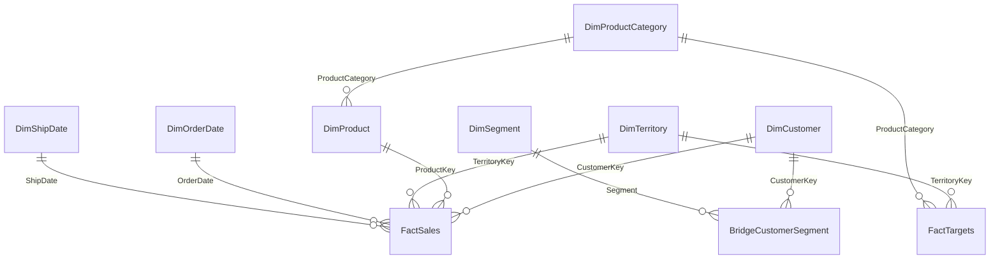

# Learner Guide

## What you will learn

In this module, you will build an advanced semantic model from synthetic business data. You will transform a report-oriented dataset into a clean star schema, add relationship patterns for real-world analysis, and evaluate advanced modeling features that may require tenant validation.

## Scenario

Contoso Advanced Manufacturing has a sales analytics report that started as a single flat table. The report is now hard to maintain, DAX is inconsistent, and new requirements require multiple date roles, customer segments, and flexible analysis paths. Your job is to create a reusable semantic model that can support multiple reports.

## Prerequisites

- Power BI Desktop
- Basic understanding of relationships and measures
- Access to the module data files in `labs\01-advanced-semantic-modeling\data`

## Azure Government readiness

The core labs use local CSV files and Power BI Desktop modeling features, so they are designed to be Gov-ready. Optional sections for composite models, DirectQuery, hybrid tables, large semantic models, and some Service validation steps are marked **Verify for Gov**.

## Lab files

| File | Purpose |
|---|---|
| `https://raw.githubusercontent.com/Coding-Forge/PBI-Advanced-Factory/main/data/sales-flat.csv` | Denormalized source table for the star schema refactor lab. |
| `https://raw.githubusercontent.com/Coding-Forge/PBI-Advanced-Factory/main/data/customer-segments.csv` | Multi-valued customer segment data for bridge-table lab. |
| `https://raw.githubusercontent.com/Coding-Forge/PBI-Advanced-Factory/main/data/targets.csv` | Sales target fact table for comparing actuals to targets. |

Power BI artifacts for this workshop should be created as PBIP projects. PBIP is the source-controlled format; PBIX can be generated from PBIP later if a packaged file is needed.

Use **Get data > Web** in Power BI Desktop to load each CSV from the raw GitHub URL.

## Tasks

1. Import the flat sales dataset.
2. Identify facts, dimensions, and attributes.
3. Create a star schema model.
4. Configure relationships and validate filter direction.
5. Add role-playing date analysis.
6. Add a bridge table for customer segments.
7. Evaluate composite model and DirectQuery design choices.
8. Validate the model against the expected outcomes.

## Core column-selection reference

Use the lab instructions for the full step-by-step walkthrough. When creating the first star schema tables, use these exact column lists.

| Query | Columns to keep |
|---|---|
| `FactSales` | `SalesOrderLineKey`, `OrderDate`, `ShipDate`, `InvoiceDate`, `CustomerKey`, `ProductKey`, `TerritoryKey`, `Quantity`, `UnitPrice`, `UnitCost`, `SalesAmount`, `GrossMargin` |
| `DimCustomer` | `CustomerKey`, `CustomerName`, `CustomerType`, `CustomerState`, `CustomerRegion` |
| `DimProduct` | `ProductKey`, `ProductName`, `ProductCategory`, `ProductSubcategory` |
| `DimProductCategory` | `ProductCategory` |
| `DimTerritory` | `TerritoryKey`, `TerritoryName`, `TerritoryRegion` |
| `FactTargets` | `TargetMonth`, `TerritoryKey`, `ProductCategory`, `TargetSalesAmount` |
| `BridgeCustomerSegment` | `CustomerKey`, `Segment` |
| `DimSegment` | `Segment` |

## Product category target pattern

`FactTargets` is at product-category grain, but `DimProduct` is at product grain. Do not relate `DimProduct[ProductCategory]` directly to `FactTargets[ProductCategory]` if Power BI detects many-to-many cardinality. Create `DimProductCategory` instead:

1. Reference `DimProduct` in Power Query.
2. Rename the referenced query to `DimProductCategory`.
3. Remove `ProductKey`, `ProductName`, and `ProductSubcategory`.
4. Keep `ProductCategory` as the only remaining column.
5. Remove duplicate rows from `ProductCategory`.
6. Relate `DimProductCategory[ProductCategory]` to both `DimProduct[ProductCategory]` and `FactTargets[ProductCategory]` as one-to-many, single-direction relationships.

## Relationship setup reference

Use this table when creating relationships in **Model view**.

| From table | From column | Key role | To table | To column | Key role | Cardinality | Cross-filter direction |
|---|---|---|---|---|---|---|---|
| `DimCustomer` | `CustomerKey` | PK | `FactSales` | `CustomerKey` | FK | One-to-many | Single |
| `DimProduct` | `ProductKey` | PK | `FactSales` | `ProductKey` | FK | One-to-many | Single |
| `DimTerritory` | `TerritoryKey` | PK | `FactSales` | `TerritoryKey` | FK | One-to-many | Single |
| `DimOrderDate` | `Date` | PK | `FactSales` | `OrderDate` | FK | One-to-many | Single |
| `DimShipDate` | `Date` | PK | `FactSales` | `ShipDate` | FK | One-to-many | Single |
| `DimTerritory` | `TerritoryKey` | PK | `FactTargets` | `TerritoryKey` | FK | One-to-many | Single |
| `DimProductCategory` | `ProductCategory` | PK | `DimProduct` | `ProductCategory` | FK | One-to-many | Single |
| `DimProductCategory` | `ProductCategory` | PK | `FactTargets` | `ProductCategory` | FK | One-to-many | Single |
| `DimSegment` | `Segment` | PK | `BridgeCustomerSegment` | `Segment` | FK | One-to-many | Single |
| `DimCustomer` | `CustomerKey` | PK | `BridgeCustomerSegment` | `CustomerKey` | FK | One-to-many | Single |

Crow's-foot model view:

Keep relationships single-direction for the core lab. If a segment slicer must directly filter sales, discuss the ambiguity and performance tradeoffs before using bidirectional filtering.

## Date table suggested pattern

Lab 1 includes two approved patterns for creating reusable date dimensions:

- **Power Query function:** Use `fn_DimDate` when you need parameterized start/end dates, a configurable fiscal-year start month, fiscal quarters, and optional holiday enrichment before the table loads.
- **DAX calculated table:** Use `CALENDAR` when you need a quick model-local `DimDate` that runs from January 1 three years before the current year through December 31 three years after the current year.

Both patterns should include numeric date attributes such as year-month-day, year-month, year, quarter, month, day, week, week number, year-week number, weekday number, and fiscal sort keys; text attributes such as month name, short month name, year-month label, quarter label, weekday name, short weekday name, fiscal year, and fiscal period; and holiday/business-day attributes when required.

Optional enterprise extensions include period boundary dates, refresh-relative offsets, current-period flags, and ISO week attributes. Add those only when the report requirements and business calendar rules justify them.

## Validate your work

Your completed model should include:

- A sales fact table.
- Date, customer, product, and territory dimensions.
- A sales target table.
- A customer segment bridge pattern.
- Measures for sales, quantity, gross margin, gross margin percentage, target, and variance.
- Date analysis for order date and ship date.
- Clear Gov-readiness notes for tenant-dependent features.

## Optional extension

If tenant and source capabilities are validated, discuss composite model and DirectQuery design choices. Calculation groups are covered in Module 2, and field parameters are covered in Module 4.

